  
    🔓 No Auth Required
  
  
    ⚡ Headless Browser Scraping
  
  
    📝 Clean Markdown Output
  

Fearch is an **open, developer-first API** that empowers you to search, scrape, and crawl the web at lightning speed. Built on top of robust Frenix infrastructure, Fearch handles dynamic JavaScript rendering, browser fingerprinting, and raw content extraction to deliver structured, high-quality markdown data directly to your applications.

---

## Core Capabilities

Discover how Fearch simplifies web data extraction for AI agents, LLMs, and research tools.

<CardGroup cols={3}>
  <Card title="Open API" icon="unlock" color="#6366f1">
    No API keys, signup forms, or credit cards required. Start querying and scraping immediately with our open endpoints.
  </Card>
  <Card title="Clean Markdown" icon="file-lines" color="#a855f7">
    Automatically converts raw HTML layouts into stripped-down, semantic Markdown—perfect for LLM prompting and ingestion.
  </Card>
  <Card title="Headless Browsing" icon="chrome" color="#10b981">
    Utilizes clustered headless browsers to execute dynamic Javascript, bypass bot protection, and load single-page apps (SPAs) rapidly.
  </Card>
</CardGroup>

---

## Architectural Workflow

Fearch abstracts all the complexity of proxy management, headless browser clusters, and HTML parsing behind simple, cohesive API endpoints.

```mermaid
graph TD
    Client([API Client / LLM]) -->|1. GET / POST Request| Fearch[Fearch API Engine]
    
    subgraph Fearch Engine [Fearch Core Services]
        Fearch -->|Search Query| SearchEngine[Web Search Orchestrator]
        Fearch -->|Single Scrape| HeadlessCluster[Headless Browser Cluster]
        Fearch -->|Crawl Job| CrawlQueue[Concurrent Crawler Node]
    end
    
    subgraph Web Targets [Target Environments]
        SearchEngine -->|Query Aggregation| WebSearch[Frenix Search Index]
        HeadlessCluster -->|Execute JS / Render| SPAPage[Dynamic Website / SPA]
        CrawlQueue -->|Follow Links / Rate limit| WebPortal[Multi-Page Portal]
    end
    
    WebSearch -->|Raw Data| Parsers[Markdown & Metadata Parser]
    SPAPage -->|HTML Snapshot| Parsers
    WebPortal -->|Batch HTML| Parsers
    
    Parsers -->|2. High-quality JSON & MD| Client
    
    style Fearch fill:#0f0f15,stroke:#6366f1,stroke-width:2px;
    style Client fill:#0a0a0f,stroke:#a855f7,stroke-width:2px;
    style WebSearch fill:#000,stroke:#10b981,stroke-width:1px;
    style SPAPage fill:#000,stroke:#10b981,stroke-width:1px;
    style WebPortal fill:#000,stroke:#10b981,stroke-width:1px;
    style Parsers fill:#1e1b4b,stroke:#a855f7,stroke-width:2px;
```

---

## Next Steps

Get started with Fearch in under two minutes by following our guides.

<CardGroup cols={2}>
  <Card title="Quickstart Guide" icon="bolt" href="/quickstart" color="#6366f1">
    Run your first search or scrape command in seconds using curl or our sandbox environment.
  </Card>
  <Card title="API Reference" icon="code" href="/api-reference/overview" color="#a855f7">
    Explore the full specifications for our Search, Scrape, and Crawl HTTP endpoints.
  </Card>
</CardGroup>
